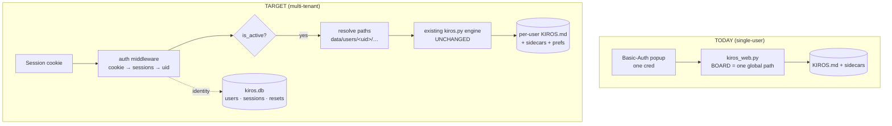

# Kiros → Multi-User: Architecture & Phased Plan

> **Status:** PLAN ONLY. No code written. Decide scope before any of this ships.
> **Date:** 2026-06-15

---

## 0. Read this first (the guardrail)

This is your documented **failure-mode #2**: *"a task system is the most seductive meta-work
there is. If Kiros gets more love than Atmosa or Cosmic Guide, it's become the distraction it
was built to kill."* Going multi-tenant is the single largest expansion possible — it turns your
personal anti-freeze tool into a **product you maintain**, with other people's data on your VPS
(backups, privacy, abuse surface all become real obligations).

**Only proceed if "share with others" is a genuine goal** (validation, a teammate/Abigail actually
using it) — not a new sandbox to disappear into.

**Exit ramps, cheapest first:**
- **Don't build.** Use it.
- **Phase 0 only** (Today cards + Today-first nav) — pure single-user polish that helps *you*, zero auth. Ship it regardless.
- **A few extra Basic-Auth creds / a second instance** for 1–3 trusted people — gets "sharing" without any of the rebuild below.
- **The full rebuild** (this doc) — only if you want a real product.

**Point of no return = Phase 1 (auth).** Everything before it is reversible single-user work.

---

## 1. The good news: the engine is already multi-tenant-ready

`kiros.py` (parsing + scoring + all mutations) takes a **board path as an argument** on every
function (`add_capture(path,…)`, `add_task_line(path,…)`, `replace_line(path,…)`, `parse_board(text)`…).
It has **no global state**. The *only* thing hardwired to one user is `kiros_web.py`, which sets three
module-level paths (`BOARD`, `DESC_FILE`, `DONE_FILE`) from one `KIROS_DATA` dir and one Basic-Auth
credential pair.

**Implication:** the scoring engine needs **zero changes**. The rebuild = an identity layer + making
the web handlers resolve those three paths **per request, from the logged-in user** instead of from
globals. That is the whole game.

---

## 2. Target architecture

**Hybrid store** — relational where we need integrity/concurrency (identity, sessions), markdown-as-truth
everywhere else (preserves the ethos; engine untouched):

- **`kiros.db`** (SQLite, stdlib `sqlite3`) — users, sessions, password-reset tokens, rate-limit + invites.
- **`data/users/<uid>/`** — that user's `KIROS.md` + `descriptions.json` + `completions.jsonl` + `prefs.json` (+ optional `bg.<ext>`). One folder per tenant = filesystem-level isolation.



### The one isolation rule (this is the answer to `#security`)

> **`uid` is derived ONLY from the verified session cookie. The board path is always
> `data/users/{session.uid}/…`. No endpoint ever accepts a user id, board path, or filename
> from the client.** Admin endpoints additionally require `users.is_admin`.

Get this rule right in Phase 1 and "does my data leak to others" is answered by construction. Phase 6
*verifies* it with tests; it isn't introduced there.

---

## 3. Tech decisions — stays zero-dependency

| Concern | Choice (all stdlib) | Note |
|---|---|---|
| Identity/session store | `sqlite3` | concurrency-safe; WAL mode |
| Password hashing | `hashlib.scrypt` (n=2^14,r=8,p=1) + per-user salt | memory-hard; store `scrypt$n$r$p$salt$hash` |
| Session tokens | `secrets.token_urlsafe(32)`; store **sha256(token)**, never the raw | cookie carries raw; DB stores hash |
| Cookie flags | `HttpOnly; Secure; SameSite=Lax; Path=/` | Secure OK — prod is HTTPS via Cloudflare |
| CSRF | double-submit: `csrf` cookie (JS-readable) echoed in `X-Kiros-CSRF` header on POST | front-end already does JSON `fetch` POST — one header to add |
| Forgot-password email | `smtplib`+`email` | **needs SMTP creds**; dev mode logs the link to console |
| Rate limiting | SQLite or in-memory counter per ip+email | guards `/login`, `/signup`, `/forgot` |
| Background-image upload | base64 in a JSON POST → decode to `data/users/<uid>/bg.<ext>` (size-capped) | keeps the all-JSON API; avoids a multipart parser |
| Per-user calendar feed | `ics_token` per user → `/u/<token>/kiros.ics` | calendar apps can't send cookies; token is revocable |

**The only non-code requirement is SMTP credentials** for password-reset email. Everything else is stdlib.
(Alternative that removes even that: magic-link login instead of passwords — but you asked for password
auth, so this plan keeps passwords.)

---

## 4. Data model

```sql
-- kiros.db  (identity + sessions only; board data stays in per-user markdown files)
CREATE TABLE users (
  id           TEXT PRIMARY KEY,                 -- uuid4 hex; also the data-dir name
  email        TEXT UNIQUE NOT NULL COLLATE NOCASE,
  name         TEXT NOT NULL DEFAULT '',
  pw_hash      TEXT NOT NULL,                     -- scrypt$n$r$p$salt$hash
  is_admin     INTEGER NOT NULL DEFAULT 0,
  is_active    INTEGER NOT NULL DEFAULT 1,        -- deactivate = soft delete (never hard-delete data)
  ics_token    TEXT UNIQUE,
  created_at   TEXT NOT NULL,
  last_seen_at TEXT                               -- drives admin "last use"
);
CREATE TABLE sessions (
  id          TEXT PRIMARY KEY,                   -- sha256(cookie token)
  user_id     TEXT NOT NULL REFERENCES users(id),
  created_at  TEXT NOT NULL,
  expires_at  TEXT NOT NULL
);
CREATE TABLE password_resets (
  token_hash  TEXT PRIMARY KEY,                   -- sha256(emailed token)
  user_id     TEXT NOT NULL REFERENCES users(id),
  expires_at  TEXT NOT NULL,
  used        INTEGER NOT NULL DEFAULT 0
);
CREATE TABLE invites (                            -- only if signup is invite-only (recommended)
  code TEXT PRIMARY KEY, created_by TEXT, used_by TEXT, expires_at TEXT
);
```

```
data/
  kiros.db
  users/
    <uid>/
      KIROS.md            ← engine reads/writes this exact path (no code change in kiros.py)
      descriptions.json
      completions.jsonl
      prefs.json          ← { theme, accent, bg:{image,opacity}, onboarded, navOrder }
      bg.<ext>            ← optional uploaded background
```

---

## 5. Per-feature breakdown (your spec → concrete work)

### `#accounts` — signup / login / forgot / reset *(Phase 1–2)*
- New full-page screens (logo on top): `/login`, `/signup`, `/forgot`, `/reset?token=…`. Replace the
  Basic-Auth browser popup entirely.
- Endpoints: `POST /api/auth/{signup,login,logout,forgot,reset}`. scrypt hashing, session cookie issue/clear,
  reset-token issue+consume, rate limiting.
- **"Turn my account into philipp.solay@gmail.com, same password"** → migration seeds `users` row:
  email `philipp.solay@gmail.com`, name "Philipp", `pw_hash` = scrypt(current `KIROS_AUTH_PASS`),
  `is_admin=1`; moves the existing `KIROS.md` + sidecars into `data/users/<your-uid>/`. Basic-Auth env retired.

### `#Profile` *(Phase 3)*
- `/profile`: change name, change password (old+new), **deactivate account** (`is_active=0` — kills login &
  sessions, never deletes data). Account icon/menu **top-right** of every screen (→ Profile, Logout, Admin if admin).
- Theme + background + color picker live here too (see §6).

### Theme · background · color *(Phase 3)* — see §6.

### `#Onboarding` *(Phase 4)*
First-run flow (gated by `prefs.onboarded`):
1. **Companies + icons** — pick contexts, choose an icon each from a **symbol library** (curated SVG set,
   e.g. Lucide/Feather, MIT, embedded — zero runtime dep). Extends the `## 🏢 Companies` parser to carry
   `· icon:<name>` (today companies are bare bullets).
2. **Context** — seed their first fronts/projects.
3. **Theme** — light/dark/system + color or background.
4. **Teach the levers** — short explainer of Importance / Urgency / Effort (copy drawn from `research/`),
   ideally a tiny interactive Eisenhower demo.

### `#Today` *(Phase 0 — do first, standalone)*
- Below the main item card, render cards for **all today-plan items**; a **Next** section with full detail cards.
- Click main **and** next cards → open the existing editor dialog (`openEditor`).
- **No backend change** — `board_payload` already returns `today`, `more`, and `todayLane`. Pure front-end.

### `#Admin` *(Phase 5)*
- `/admin`, **`is_admin` only** (403 otherwise). Table per user: name, email, #companies, #projects(fronts),
  #tasks, **last use** (`last_seen_at`). Counts read from `kiros.db` + each user's board file.

### `#security` *(Phase 6 + cross-cutting)*
- **Tenant isolation** — enforce the §2 rule; add tests proving User B can't read User A's data (see §9).
- **Asana** — there is **no in-app "connect to Asana"** to hide. The only surface is the per-task
  "Open in Asana ↗" link (`#ed-source`), which is just that task's own source URL. Real Asana wiring lives in
  Claude/`kiros-review` + `sources.md` + your `.env` — none of which ship to tenants, and the per-user data
  layout keeps `sources.md`/GIDs/creds out of others' reach. Action: generalize the link label to
  "Open source ↗" and confirm no Asana identifiers leak into other users' boards.
- Per-user **tokenized ICS** (replaces the global `/kiros.ics`); cookie flags; CSRF; rate limits.

### `#Nav` *(Phase 0)*
- Reorder tabs so **Today is first** (`index.html` `<nav>` + `VIEWS` in app.js). Decide whether
  `DEFAULT_VIEW` also becomes `"today"` (currently `"board"`).

---

## 6. Theming (light / dark / system + background + color)

Today: one hardcoded warm-dark `:root` token set; **all colors already flow through tokens** (so this is
mostly additive). Plan:
- `<html data-theme="system|light|dark">`. Define a **light** token set + keep dark; `system` follows
  `@media (prefers-color-scheme)`. Design a calm **warm-light** palette (off-white surfaces, same clay
  `--accent #D97757`). Note: a few on-accent texts are hardcoded `#1a1209` (fab/primary/capture) — fine to
  keep (dark-on-clay reads in both themes) or tokenize as `--on-accent`.
- **Color picker** → overrides `--accent` (optionally `--bg`), persisted in `prefs.json`.
- **Background image + opacity** → uploaded (base64 JSON, §3) to `data/users/<uid>/bg.<ext>`, served per-user;
  rendered behind surfaces with a user-set opacity/scrim CSS var.
- Persistence: `prefs.json` per user; client applies on load (pre-paint, to avoid theme flash).

---

## 7. Phasing

| Ph | Deliverable | Ships independently? | Touches | Est (ideal days) |
|----|-------------|----------------------|---------|------------------|
| **0** | Today cards + Next cards + click-to-open + Today-first nav | ✅ single-user, no auth | `web/*` only | 0.5–1 |
| **1** | Identity backbone: `kiros.db`, users/sessions, scrypt, **per-request uid→path refactor**, migrate your account, session-cookie auth replaces Basic-Auth (you still log in; no new screens yet) | internal | new `store.py`+`auth.py`, `kiros_web.py` surgery, migration script | 3–5 |
| **2** | Auth screens: login/signup(invite)/forgot/reset (logo top) + rate-limit + email | ✅ others can join | new pages + `/api/auth/*` | 3–5 |
| **3** | Profile + theming: name/password/deactivate, light/dark/system, bg image+opacity, color picker, top-right account menu | ✅ | `prefs.json`, CSS tokens, profile UI | 4–6 |
| **4** | Onboarding: companies+icons, symbol library, context, theme, teach Imp/Urg/Effort | ✅ | onboarding flow, icon set, company-icon parse | 3–5 |
| **5** | Admin dashboard (per-user metrics) | ✅ | admin page + endpoints | 1–2 |
| **6** | Security hardening + isolation audit: leak tests, tokenized ICS, Asana surface review, cookie/CSRF/rate-limit review | ✅ gate to prod | tests, ICS refactor | 2–3 |

**Total ≈ 17–27 ideal days** (real calendar time longer). Phase 0 is the cheap win — ship it even if you
never do the rest. Isolation is **built** in Phase 1, **verified** in Phase 6.

---

## 8. Migration (your account)

One-shot script: create `kiros.db`; insert your admin user (email `philipp.solay@gmail.com`, password =
current `KIROS_AUTH_PASS`, `is_admin=1`, fresh `ics_token`); `mkdir data/users/<your-uid>/`; move existing
`KIROS.md` + `descriptions.json` + `completions.jsonl` into it; write default `prefs.json`. Idempotent; keep a
backup of the current `data/` first. Retire `KIROS_AUTH_USER/PASS`.

---

## 9. Testing (keeps your ≥80% bar; extends `test_kiros.py`)

- **Auth:** scrypt round-trip & rejection; session issue/expire/logout; CSRF accept/reject; rate-limit trips.
- **Isolation (the critical ones):**
  - User B's session can never read/write User A's board, sidecars, prefs, or ICS.
  - Every handler resolves paths from `session.uid`; **no route accepts a client-supplied id/path** (negative tests).
  - Deactivated user → login blocked, existing sessions invalidated.
  - Admin routes → 403 for non-admins.
- Engine tests unchanged (52 today) — `kiros.py` isn't modified.

---

## 10. Open questions (decide before Phase 2 — the point of no return)

1. **Signup model:** open / **invite-code (recommended)** / admin-provisioned? Drives abuse surface.
2. **Email:** which SMTP provider for reset links? (Or accept magic-link auth to drop passwords+email entirely.)
3. **Light palette:** needs a short design pass + your sign-off (calm warm-light, same clay accent).
4. **Icon/symbol library:** confirm set + license (recommend Lucide/Feather — MIT, embed SVGs).
5. **Background upload:** base64-JSON (recommended, zero-dep) vs URL-only vs a multipart parser?
6. **Hosting/ops:** same single container at `kairos.solay.cloud`, now with DB + user-data volumes. Backups
   become mandatory (others' data). Add a basic privacy note?
7. **Nav:** does Today also become the **default** view, or just first tab?

---

## 11. Risks

- **Guardrail (biggest):** weeks of meta-work on the tool most prone to becoming your distraction.
- **Point of no return = Phase 1.** Before it, all work is reversible single-user polish.
- **You take on others' data:** backups, privacy, and a minimal abuse/rate-limit posture become real.
- **Only friction to zero-deps:** SMTP creds (email) and the background-upload path — both have stdlib answers above.

---

## Recommendation

Ship **Phase 0** now (real value to you, no commitment). Treat **Phase 1** as a deliberate go/no-go: only
cross it if sharing is a real goal. If "sharing" means 1–3 trusted people, seriously weigh the
extra-creds / second-instance exit ramp over this entire rebuild.
